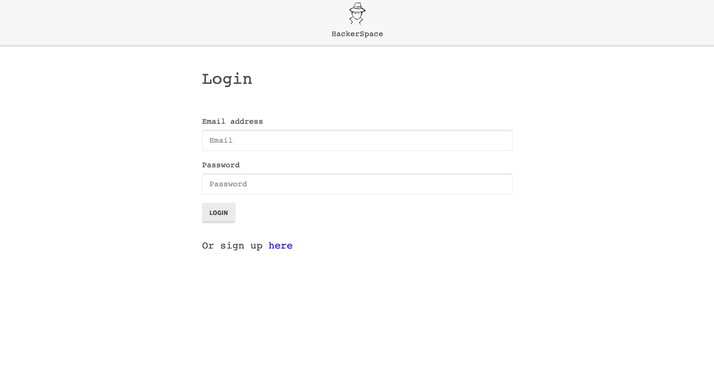

# Burger Eater

## license


## Description

This is an application for developrers to have their own profile where they can post code for others to see and for them to keep as a code note-pad instead of having notes spread across multiple files. Users of the application can look for other users and see their post and code snippets that the developers around you use on the daily bases.

## Main Window

  


## Table of contents

- [Description](#Description)
- [Main Window](#MainWindow)
- [Installation](#Installation)
- [Usage](#Usage)
- [Licence](#License)
- [Contributors](#Contributors)
- [Test](#Test)
- [Repository Link](#Repository)
- [GitHub Info](#GitHub)

  ## Installation

  - Clone the reposatory into a local file in you're computer.
  - Run "npm i" inside of the terminal.
  - Add the schema into your personal MySql Work Bench.
  - Inside of the "config" folder there is a "config.json" file , add the the password to your workbench ("root","" or your personal password).
  - Run "node server" on the integrated terminal, the app should run on "http://localhost:8080/".

  ## Usage

- The app's database is created on the MySql Workbench, the way we decided to interact with the database was using the Sequelize ORM there for we used "models" instead of "tables". This made the code more legible and efficient when it comes to writing the code and running queries to the database.
One of the advantages of using MySql was the relationships in between the tables and the information that was needed for each user.
- To implement the authentication of the user when logged into the application, we use the the npm package "express-session", this package allows to store the id of the session that is created when the user logs in; Stored inside of a cookie. 
- To make sure that the password of our user is safe we use the "bcryptjs" npm package. This package allows us to encrypt the password that sent to the database. When the user logs in the password is encrypted again and compared it with the one that is saved in the database.
- The images for the profile picture of the user are handled by an npm package called "multer", this package allowed us to handle multipart-form/data structures there for we can specify a maximum size for the image and helps us validate that the input is an actual image itself, these images are served thru a static folder named "uploads", this is the actual destination of the image itself.

 ## Directory 

 ```
├── config
│   ├── connection.js
│   └── orm.js
│ 
├── controllers
│   └── burgersController.js
│
├── db
│   ├── schema.sql
│   └── seeds.sql
│
├── models
│   └── burger.js
│ 
├── node_modules
│ 
│── public
│   └── assets
│       ├── css
│       │   └── style.css
│       ├──js
│       │   └── burger.js
│       └── img
│           └── appImage.png
│
├──views
│    ├── index.handlebars
│    ├── layouts
│    │    └── main.handlebars
│    └── partials
│         └── burger-block.handlebars
│
├── .gitignore
│
├── package-lock.json
│
├── package.json   
│
├── server.js
│
└──README.md

```

  ## Constributors

  Miguelangel Weill, Alexander de Sostoa, Michael Muniz, Thalia Rodriguez.

  ## Test
  * People that you can search for : 
  - Miguelangel Weill
  - Johnsito doe
  - alexander de sostoa

  

  ## Git hub user name

  - Asostoa/Hackerspace 
  - Url: https://github.com/Asostoa/HackerSpace

  ## Deployed Heroku Url

  - Url: https://fast-bayou-85635.herokuapp.com/

  ## Repository


[Git hub profile](https://api.github.com/users/Miguelangelweill)

[This is my Git Hub repository](https://github.com/Miguelangelweill)
